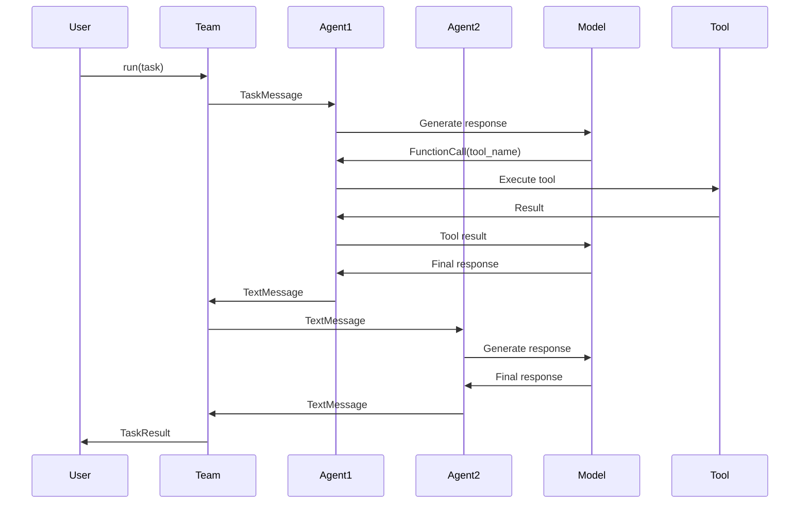

# Core Concepts

This guide explains the fundamental concepts behind AutoGen: what agents are, how they work together in teams, how they use tools and models, and how the layered architecture provides flexibility for different use cases.

## What is an Agent?

An **agent** is a software entity that:
- Communicates via messages
- Maintains its own state
- Performs actions in response to messages
- Can modify its state and produce external effects

```python
# A simple assistant agent
agent = AssistantAgent(
    name="assistant",
    model_client=model_client,
    system_message="You are a helpful assistant."
)

# Run the agent with a task
result = await agent.run(task="Explain quantum computing")
```

Agents in AutoGen are built on the **Actor model**, where each agent:
- Processes messages independently
- Maintains isolated state
- Communicates only through message passing
- Can create new agents or send messages to others

<Info>
  Think of agents as autonomous workers with specialized roles. They don't share memory directly but collaborate by exchanging messages.
</Info>

## Types of Agents

AutoGen provides several preset agent types in the AgentChat API:

<CardGroup cols={2}>
  <Card title="AssistantAgent" icon="robot">
    **LLM-powered agent**
    
    Uses a language model to process messages and can call tools. Supports reflection on tool use and streaming.
    
    ```python
    agent = AssistantAgent(
        name="coder",
        model_client=model_client,
        tools=[code_tool],
        system_message="You write code."
    )
    ```
  </Card>
  
  <Card title="CodeExecutorAgent" icon="code">
    **Safe code execution**
    
    Executes Python code in isolated environments (Docker or local). Returns results or errors.
    
    ```python
    agent = CodeExecutorAgent(
        name="executor",
        code_execution_config={
            "executor": DockerCommandLineCodeExecutor()
        }
    )
    ```
  </Card>
  
  <Card title="UserProxyAgent" icon="user">
    **Human-in-the-loop**
    
    Represents human users in multi-agent workflows. Can request input or operate autonomously.
    
    ```python
    agent = UserProxyAgent(
        name="user",
        human_input_mode="ALWAYS"
    )
    ```
  </Card>
  
  <Card title="Custom Agents" icon="wrench">
    **Build your own**
    
    Implement custom behavior by extending base classes or using the Core API.
    
    ```python
    class MyAgent(BaseChatAgent):
        async def on_messages(
            self, messages, cancellation_token
        ):
            # Custom logic
            return Response(...)
    ```
  </Card>
</CardGroup>

### Agent Characteristics

All agents share these properties:

- **Name**: Unique identifier within a team
- **State**: Internal data maintained across messages
- **Message Handling**: Logic for processing incoming messages
- **Actions**: Operations performed in response to messages

Agents can:
- Send messages to other agents
- Call tools to interact with external systems
- Generate responses using LLMs
- Execute code or make API calls
- Maintain conversation history

## Multi-Agent Teams

A **team** is a group of agents working together toward a common goal. Teams implement multi-agent design patterns through coordinated message passing.

### Why Teams?

<AccordionGroup>
  <Accordion title="Separation of Concerns">
    Each agent handles a specific responsibility:
    - One agent writes code
    - Another reviews it
    - A third executes it
    - A fourth summarizes results
    
    This is clearer than one agent doing everything.
  </Accordion>

  <Accordion title="Diverse Expertise">
    Different agents can use:
    - Different models (GPT-4 for reasoning, GPT-4o-mini for simple tasks)
    - Different tools (one has web access, another has database access)
    - Different instructions specialized for their role
  </Accordion>

  <Accordion title="Reflection and Critique">
    Agents can review each other's work:
    - A writer agent creates content
    - A critic agent provides feedback
    - They iterate until quality is acceptable
    
    This often produces better results than a single agent.
  </Accordion>

  <Accordion title="Parallel Processing">
    Multiple agents can work simultaneously:
    - Research agent gathers information
    - Analysis agent processes data
    - Visualization agent creates charts
    
    Then results are combined by an orchestrator.
  </Accordion>
</AccordionGroup>

### Team Types

AutoGen provides several preset team patterns:

<Tabs>
  <Tab title="RoundRobinGroupChat">
    Agents take turns in a fixed order. Simple and predictable.
    
    ```python
    from autogen_agentchat.teams import RoundRobinGroupChat
    from autogen_agentchat.conditions import TextMentionTermination
    
    team = RoundRobinGroupChat(
        participants=[writer, reviewer, editor],
        termination_condition=TextMentionTermination("DONE")
    )
    
    result = await team.run(task="Write a blog post about AI")
    ```
    
    **Use when**: You want deterministic turn-taking, like writer → reviewer → editor cycles.
  </Tab>
  
  <Tab title="SelectorGroupChat">
    An LLM selects the next speaker based on context. More dynamic.
    
    ```python
    from autogen_agentchat.teams import SelectorGroupChat
    
    team = SelectorGroupChat(
        participants=[researcher, writer, fact_checker],
        model_client=model_client,  # Uses LLM to select next speaker
        termination_condition=max_turns_condition
    )
    
    result = await team.run(task="Research and write about climate change")
    ```
    
    **Use when**: The next speaker should be chosen based on the conversation state, not a fixed pattern.
  </Tab>
  
  <Tab title="Swarm">
    Agents hand off tasks using explicit HandoffMessage signals.
    
    ```python
    from autogen_agentchat.teams import Swarm
    from autogen_agentchat.messages import HandoffMessage
    
    # Agents return HandoffMessage to transfer control
    team = Swarm(
        participants=[intake_agent, specialist_agent, closing_agent]
    )
    
    result = await team.run(task="Handle customer inquiry")
    ```
    
    **Use when**: You want explicit, agent-controlled handoffs like a customer service workflow.
  </Tab>
  
  <Tab title="GraphFlow">
    Agents arranged in a directed graph (workflow). Supports branching and conditionals.
    
    ```python
    from autogen_agentchat.teams import GraphFlow
    
    # Define workflow as a graph
    team = GraphFlow(
        nodes={
            "start": start_agent,
            "analyze": analyzer_agent,
            "summarize": summarizer_agent,
        },
        edges={
            "start": ["analyze"],
            "analyze": ["summarize"],
        }
    )
    
    result = await team.run(task="Process data")
    ```
    
    **Use when**: You need complex workflows with branching logic and conditional paths.
  </Tab>
</Tabs>

### Team Patterns

Common multi-agent design patterns:

- **Reflection**: Primary agent generates, critic reviews, iterate until approved
- **Hierarchical**: Orchestrator delegates to specialist agents
- **Sequential**: Agents form a pipeline (research → write → edit → publish)
- **Parallel**: Multiple agents work independently, results aggregated
- **Debate**: Agents with different perspectives discuss to reach consensus

<Note>
  Start with a single agent and only move to teams when the task genuinely requires collaboration. Teams need more careful prompting and debugging.
</Note>

## Tools

Tools allow agents to interact with the external world beyond text generation. An agent with tools can:
- Call APIs
- Query databases
- Execute code
- Search the web
- Read/write files
- Control browsers

### Function Tools

The simplest way to add tools is by passing Python functions:

```python
async def get_weather(city: str) -> str:
    """Get current weather for a city.
    
    Args:
        city: Name of the city
        
    Returns:
        Weather description
    """
    # Call weather API
    return f"Weather in {city}: 72°F, sunny"

async def calculate(expression: str) -> float:
    """Evaluate a math expression.
    
    Args:
        expression: Mathematical expression to evaluate
        
    Returns:
        Numerical result
    """
    return eval(expression)

# Agent can use both tools
agent = AssistantAgent(
    name="assistant",
    model_client=model_client,
    tools=[get_weather, calculate],
)
```

<Info>
  AutoGen automatically generates JSON schemas from function signatures and docstrings. Use type hints and descriptive docstrings for best results.
</Info>

### How Tools Work

1. **Agent receives a task**: "What's the weather in Seattle?"
2. **LLM decides to use a tool**: Returns a function call request
3. **Framework executes the tool**: Calls `get_weather("Seattle")`
4. **Result returned to LLM**: "Weather in Seattle: 72°F, sunny"
5. **LLM generates response**: "The weather in Seattle is currently 72°F and sunny."

This is called **function calling** or **tool use**.

### Advanced Tool Types

<Tabs>
  <Tab title="MCP Servers">
    Model Context Protocol servers provide collections of tools:
    
    ```python
    from autogen_ext.tools.mcp import McpWorkbench, StdioServerParams
    
    # Connect to Playwright MCP server for web browsing
    server_params = StdioServerParams(
        command="npx",
        args=["@playwright/mcp@latest", "--headless"]
    )
    
    async with McpWorkbench(server_params) as mcp:
        agent = AssistantAgent(
            name="browser",
            model_client=model_client,
            workbench=mcp,  # Agent gets all MCP tools
        )
        
        result = await agent.run(
            task="Go to example.com and get the page title"
        )
    ```
    
    Popular MCP servers:
    - **@playwright/mcp**: Browser automation
    - **@modelcontextprotocol/server-filesystem**: File operations
    - **@modelcontextprotocol/server-postgres**: Database queries
  </Tab>
  
  <Tab title="Code Execution">
    Execute generated code safely:
    
    ```python
    from autogen_ext.tools.code_execution import PythonCodeExecutionTool
    from autogen_ext.code_executors import DockerCommandLineCodeExecutor
    
    # Execute in Docker for isolation
    executor = DockerCommandLineCodeExecutor()
    code_tool = PythonCodeExecutionTool(executor)
    
    agent = AssistantAgent(
        name="coder",
        model_client=model_client,
        tools=[code_tool],
    )
    
    result = await agent.run(
        task="Calculate the first 10 Fibonacci numbers"
    )
    ```
  </Tab>
  
  <Tab title="Agent Tools">
    Use agents as tools for hierarchical workflows:
    
    ```python
    from autogen_agentchat.tools import AgentTool
    
    # Create specialist agents
    math_agent = AssistantAgent(
        "math_expert",
        model_client,
        system_message="You are a math expert."
    )
    
    chemistry_agent = AssistantAgent(
        "chemistry_expert",
        model_client,
        system_message="You are a chemistry expert."
    )
    
    # Wrap agents as tools
    math_tool = AgentTool(math_agent)
    chemistry_tool = AgentTool(chemistry_agent)
    
    # Orchestrator uses specialist agents as tools
    orchestrator = AssistantAgent(
        "orchestrator",
        model_client,
        tools=[math_tool, chemistry_tool],
        system_message="Delegate to experts."
    )
    ```
  </Tab>
  
  <Tab title="Custom Tools">
    Implement the tool interface for full control:
    
    ```python
    from autogen_core.tools import BaseTool, ToolSchema
    
    class DatabaseTool(BaseTool):
        def __init__(self, db_connection):
            self._db = db_connection
            
        @property
        def schema(self) -> ToolSchema:
            return ToolSchema(
                name="query_database",
                description="Query the database",
                parameters={
                    "type": "object",
                    "properties": {
                        "query": {"type": "string"}
                    },
                    "required": ["query"]
                }
            )
            
        async def run(self, query: str) -> str:
            result = await self._db.execute(query)
            return str(result)
    ```
  </Tab>
</Tabs>

<Warning>
  **Security**: Tools can execute arbitrary code or access sensitive systems. Only use trusted tools and validate inputs carefully. MCP servers should only be from trusted sources.
</Warning>

## Models

Models are the LLMs that power agent reasoning and text generation. AutoGen uses a **model client** abstraction to support multiple providers.

### Model Clients

All model clients implement the `ChatCompletionClient` interface:

<Tabs>
  <Tab title="OpenAI">
    ```python
    from autogen_ext.models.openai import OpenAIChatCompletionClient
    
    model_client = OpenAIChatCompletionClient(
        model="gpt-4o",
        api_key="sk-...",  # Or use OPENAI_API_KEY env var
        temperature=0.7,
        max_tokens=2000,
    )
    ```
    
    Supported models:
    - `gpt-4o` - Latest multimodal model
    - `gpt-4o-mini` - Faster, cheaper variant
    - `gpt-4-turbo` - Previous generation
    - `o1-preview` - Advanced reasoning
  </Tab>
  
  <Tab title="Azure OpenAI">
    ```python
    from autogen_ext.models.openai import AzureOpenAIChatCompletionClient
    
    model_client = AzureOpenAIChatCompletionClient(
        azure_deployment="your-deployment-name",
        model="gpt-4o",
        api_version="2024-02-15-preview",
        azure_endpoint="https://your-resource.openai.azure.com",
        api_key="...",  # Or use azure.identity for AAD
    )
    ```
    
    For AAD authentication:
    ```python
    from azure.identity import DefaultAzureCredential
    
    model_client = AzureOpenAIChatCompletionClient(
        azure_deployment="your-deployment",
        model="gpt-4o",
        azure_endpoint="https://your-resource.openai.azure.com",
        credential=DefaultAzureCredential(),
    )
    ```
  </Tab>
  
  <Tab title="Anthropic Claude">
    ```python
    from autogen_ext.models.anthropic import AnthropicClient
    
    model_client = AnthropicClient(
        model="claude-3-5-sonnet-20241022",
        api_key="sk-ant-...",
        max_tokens=4096,
    )
    ```
    
    Supported models:
    - `claude-3-5-sonnet-20241022` - Most capable
    - `claude-3-5-haiku-20241022` - Fast and affordable
    - `claude-3-opus-20240229` - Previous flagship
  </Tab>
  
  <Tab title="Google Gemini">
    ```python
    from autogen_ext.models.gemini import GeminiClient
    
    model_client = GeminiClient(
        model="gemini-2.0-flash-exp",
        api_key="...",
    )
    ```
  </Tab>
  
  <Tab title="Local Models">
    Use Ollama for local models:
    
    ```python
    from autogen_ext.models.ollama import OllamaChatCompletionClient
    
    model_client = OllamaChatCompletionClient(
        model="llama3.2",
        base_url="http://localhost:11434",
    )
    ```
    
    Or llama.cpp:
    
    ```python
    from autogen_ext.models.llamacpp import LlamaCppChatCompletionClient
    
    model_client = LlamaCppChatCompletionClient(
        model_path="/path/to/model.gguf",
        n_ctx=4096,
    )
    ```
  </Tab>
</Tabs>

### Model Capabilities

Different models have different capabilities:

| Feature | OpenAI GPT-4o | Claude 3.5 Sonnet | Gemini 2.0 Flash | Local (Llama 3.2) |
|---------|---------------|-------------------|------------------|-------------------|
| Function Calling | ✅ | ✅ | ✅ | ⚠️ Limited |
| Streaming | ✅ | ✅ | ✅ | ✅ |
| Vision (Images) | ✅ | ✅ | ✅ | ❌ |
| JSON Mode | ✅ | ❌ | ✅ | ⚠️ Varies |
| Max Context | 128K | 200K | 1M | Varies |

<Info>
  Choose models based on your needs:
  - **Complex reasoning**: GPT-4o, Claude 3.5 Sonnet, o1
  - **Speed/cost**: GPT-4o-mini, Claude Haiku, Gemini Flash
  - **Privacy**: Local models (Ollama)
  - **Long context**: Claude (200K), Gemini (1M)
</Info>

## Layered Architecture

AutoGen's three-layer design gives you flexibility to choose the right abstraction level:

<Steps>
  <Step title="Layer 1: Core API (Foundation)">
    **Event-driven agent runtime**
    
    The foundation layer provides:
    - Message-passing infrastructure
    - Agent lifecycle management
    - Topic-based pub/sub
    - Standalone and distributed runtimes
    - Cross-language support (Python ↔ .NET)
    
    ```python
    from autogen_core import SingleThreadedAgentRuntime, MessageContext
    from autogen_core import RoutedAgent, message_handler
    
    class MyAgent(RoutedAgent):
        @message_handler
        async def handle_message(self, message: str, ctx: MessageContext):
            # Custom event-driven logic
            await self.publish_message(response, topic="results")
    
    runtime = SingleThreadedAgentRuntime()
    await runtime.register("MyAgent", MyAgent)
    await runtime.start()
    ```
    
    **Use when**:
    - You need event-driven architecture
    - You want distributed execution across machines
    - You need cross-language agents (Python + .NET)
    - You want full control over message routing
  </Step>
  
  <Step title="Layer 2: AgentChat API (High-Level)">
    **Intuitive defaults for rapid development**
    
    Built on Core API with:
    - Preset agent types (AssistantAgent, CodeExecutorAgent)
    - Team patterns (RoundRobin, Selector, Swarm)
    - Termination conditions
    - Streaming helpers
    - Human-in-the-loop support
    
    ```python
    from autogen_agentchat.agents import AssistantAgent
    from autogen_agentchat.teams import RoundRobinGroupChat
    
    # High-level, opinionated API
    agent = AssistantAgent(
        name="assistant",
        model_client=model_client,
        tools=[weather_tool],
    )
    
    result = await agent.run(task="What's the weather?")
    ```
    
    **Use when**:
    - You're prototyping quickly
    - You want sensible defaults
    - You're new to AutoGen
    - Common patterns fit your use case
  </Step>
  
  <Step title="Layer 3: Extensions API (Ecosystem)">
    **Pluggable components**
    
    Extensions provide:
    - Model clients (OpenAI, Anthropic, Azure, etc.)
    - Code executors (Docker, Jupyter)
    - Memory systems (ChromaDB, Redis)
    - Tool integrations (MCP, web browsing)
    - Custom implementations welcome
    
    ```python
    # Mix and match extensions
    from autogen_ext.models.openai import OpenAIChatCompletionClient
    from autogen_ext.tools.mcp import McpWorkbench
    from autogen_ext.code_executors import DockerCommandLineCodeExecutor
    
    # All extensions work together
    ```
    
    **Use when**:
    - You need specific model providers
    - You want tool integrations
    - You're building custom components
    - You need production features (memory, caching)
  </Step>
</Steps>

### Choosing the Right Layer

<CardGroup cols={2}>
  <Card title="Start with AgentChat">
    **Recommended for beginners**
    
    - Quickest path to working agents
    - Best documentation and examples
    - Covers 80% of use cases
    - Easy to drop to Core API later
  </Card>
  
  <Card title="Drop to Core When Needed">
    **For advanced scenarios**
    
    - Custom message protocols
    - Event-driven patterns
    - Distributed execution
    - Cross-language requirements
  </Card>
</CardGroup>

<Note>
  **Layer Philosophy**: Start high (AgentChat), go deep (Core) when needed, extend freely (Extensions). You're never locked in.
</Note>

## Message Flow

Understanding how messages flow is key to understanding AutoGen:



### Message Types

- **TextMessage**: Plain text from an agent
- **FunctionCall**: Request to execute a tool
- **FunctionExecutionResult**: Tool execution result
- **ToolCallSummaryMessage**: Summary of tool calls
- **HandoffMessage**: Transfer control between agents
- **TaskMessage**: Initial task from user
- **StopMessage**: Signal termination

## Runtime Environments

AutoGen supports two runtime modes:

<Tabs>
  <Tab title="Standalone Runtime">
    **Single-process execution**
    
    All agents run in the same process. Simple and fast.
    
    ```python
    from autogen_core import SingleThreadedAgentRuntime
    
    runtime = SingleThreadedAgentRuntime()
    await runtime.register("agent1", Agent1)
    await runtime.register("agent2", Agent2)
    await runtime.start()
    ```
    
    **Use for**:
    - Development and testing
    - Single-machine deployments
    - Simpler debugging
    - Lower latency
  </Tab>
  
  <Tab title="Distributed Runtime">
    **Multi-process/multi-machine execution**
    
    Agents run across workers, coordinated by a host.
    
    ```python
    from autogen_ext.runtimes.grpc import GrpcWorkerAgentRuntime
    
    # Worker process
    runtime = GrpcWorkerAgentRuntime(host="grpc://host:50051")
    await runtime.register("agent1", Agent1)
    await runtime.start()
    ```
    
    **Use for**:
    - Production deployments
    - Scaling across machines
    - Language interop (Python + .NET)
    - Isolation between agents
  </Tab>
</Tabs>

<Info>
  Agents work the same way in both runtimes. You can develop with standalone and deploy with distributed without changing agent code.
</Info>

## Next Steps

Now that you understand the concepts:

<CardGroup cols={2}>
  <Card
    title="Build Multi-Agent Teams"
    icon="users"
    href="/agentchat/teams"
  >
    Learn team patterns and collaboration
  </Card>
  <Card
    title="Work with Tools"
    icon="wrench"
    href="/agentchat/tools"
  >
    Add function tools, MCP servers, and code execution
  </Card>
  <Card
    title="Configure Models"
    icon="brain"
    href="/agentchat/models"
  >
    Set up different LLM providers
  </Card>
  <Card
    title="Explore Core API"
    icon="cube"
    href="/core/overview"
  >
    Event-driven patterns and distributed runtime
  </Card>
</CardGroup>

## Key Takeaways

- **Agents** are autonomous entities that communicate via messages
- **Teams** coordinate multiple agents using patterns like RoundRobin or Swarm
- **Tools** let agents interact with external systems via function calling
- **Models** provide LLM capabilities through a unified client interface
- **Layered architecture** gives you flexibility: start simple, go deep when needed
- **Message passing** is the foundation of all agent communication
- **Runtimes** support both single-process and distributed execution

<Note>
  The best way to learn is by building. Try the [Examples](/examples/hello-world) to see these concepts in action.
</Note>