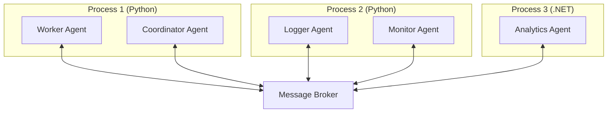

The distributed runtime extends AutoGen Core's capabilities beyond a single process, enabling agents to communicate across process boundaries, machines, and even programming languages.

<Info>
  The distributed runtime implements the same `AgentRuntime` protocol as `SingleThreadedAgentRuntime`, making it easy to scale from development to production.
</Info>

## Architecture Overview

The distributed runtime uses a message broker to route messages between agent instances running in different processes or on different machines.



**Key features:**

- **Process isolation**: Agents run in separate processes for fault tolerance
- **Horizontal scaling**: Add more agent instances to handle load
- **Cross-language**: Python agents can communicate with .NET agents
- **Location transparency**: Agents don't know or care where other agents are running

## Core Concepts

### Message Broker

The distributed runtime uses a message broker (like gRPC, Redis, or RabbitMQ) to route messages between agent processes.

### Agent Registration

Each agent process registers its agent types and subscriptions with the runtime. The runtime coordinates with the broker to route messages correctly.

### Serialization

Messages are serialized when sent across process boundaries. AutoGen Core supports JSON and Protocol Buffers.

```python
from autogen_core import JSON_DATA_CONTENT_TYPE, PROTOBUF_DATA_CONTENT_TYPE

print(JSON_DATA_CONTENT_TYPE)      # "application/json"
print(PROTOBUF_DATA_CONTENT_TYPE)  # "application/protobuf"
```

## Setting Up Distributed Runtime

<Note>
  The exact distributed runtime implementation may vary based on your deployment. This section covers general patterns. Refer to the AutoGen distributed runtime documentation for specific implementation details.
</Note>

### Example: Multi-Process Setup

#### Process 1: Worker Agent

```python
import asyncio
from dataclasses import dataclass
from autogen_core import (
    RoutedAgent,
    MessageContext,
    rpc
)

# Assume distributed_runtime is configured
from autogen_core.distributed import create_distributed_runtime

@dataclass
class WorkRequest:
    task_id: str
    data: dict

@dataclass
class WorkResponse:
    task_id: str
    result: str

class Worker(RoutedAgent):
    def __init__(self):
        super().__init__("Worker agent")
    
    @rpc
    async def process_work(self, message: WorkRequest, ctx: MessageContext) -> WorkResponse:
        # Process the work
        result = f"Processed task {message.task_id}"
        return WorkResponse(task_id=message.task_id, result=result)

async def main():
    # Create distributed runtime connected to broker
    runtime = await create_distributed_runtime(
        broker_url="grpc://localhost:50051",
        instance_id="worker-process-1"
    )
    
    # Register worker agent
    await Worker.register(runtime, "worker", lambda: Worker())
    
    # Start runtime (listens for messages)
    await runtime.start()
    
    # Keep running
    await runtime.wait_until_stopped()

if __name__ == "__main__":
    asyncio.run(main())
```

#### Process 2: Coordinator Agent

```python
import asyncio
from dataclasses import dataclass
from autogen_core import (
    RoutedAgent,
    MessageContext,
    AgentId,
    event
)
from autogen_core.distributed import create_distributed_runtime

@dataclass
class StartTask:
    task_id: str
    data: dict

class Coordinator(RoutedAgent):
    def __init__(self):
        super().__init__("Coordinator agent")
    
    @event
    async def handle_start(self, message: StartTask, ctx: MessageContext) -> None:
        # Send work to worker agent (in different process)
        response = await self.send_message(
            WorkRequest(task_id=message.task_id, data=message.data),
            recipient=AgentId("worker", "default")
        )
        print(f"Worker completed: {response.result}")

async def main():
    # Connect to same broker
    runtime = await create_distributed_runtime(
        broker_url="grpc://localhost:50051",
        instance_id="coordinator-process-1"
    )
    
    # Register coordinator
    await Coordinator.register(runtime, "coordinator", lambda: Coordinator())
    
    await runtime.start()
    
    # Send initial task
    await runtime.publish_message(
        StartTask(task_id="task-1", data={"key": "value"}),
        topic_id=TopicId(type="tasks", source="system")
    )
    
    await runtime.wait_until_stopped()

if __name__ == "__main__":
    asyncio.run(main())
```

## Cross-Language Communication

The distributed runtime supports agents written in different languages communicating through the message broker.

### Python to .NET Example

#### Python Agent

```python
from dataclasses import dataclass
from autogen_core import RoutedAgent, MessageContext, AgentId, rpc

@dataclass
class AnalyticsRequest:
    data_points: list[float]

@dataclass
class AnalyticsResponse:
    mean: float
    std_dev: float

class DataCollector(RoutedAgent):
    def __init__(self):
        super().__init__("Data collector")
    
    @rpc
    async def analyze(self, message: CollectRequest, ctx: MessageContext) -> CollectResponse:
        # Collect data
        data = await self.collect_data()
        
        # Send to .NET analytics agent
        result = await self.send_message(
            AnalyticsRequest(data_points=data),
            recipient=AgentId("analytics", "default")  # .NET agent
        )
        
        return CollectResponse(mean=result.mean, std_dev=result.std_dev)
```

#### C# (.NET) Agent

```csharp
using AutoGen.Core;
using System.Threading.Tasks;

public record AnalyticsRequest(float[] DataPoints);
public record AnalyticsResponse(float Mean, float StdDev);

public class AnalyticsAgent : RoutedAgent
{
    public AnalyticsAgent() : base("Analytics agent") { }
    
    [RpcMethod]
    public async Task<AnalyticsResponse> Analyze(
        AnalyticsRequest message,
        MessageContext ctx)
    {
        // Calculate statistics
        var mean = message.DataPoints.Average();
        var variance = message.DataPoints.Select(x => Math.Pow(x - mean, 2)).Average();
        var stdDev = Math.Sqrt(variance);
        
        return new AnalyticsResponse(mean, (float)stdDev);
    }
}

// Registration
var runtime = await DistributedRuntime.CreateAsync(
    brokerUrl: "grpc://localhost:50051",
    instanceId: "analytics-process-1"
);

await AnalyticsAgent.RegisterAsync(
    runtime,
    "analytics",
    () => new AnalyticsAgent()
);

await runtime.StartAsync();
```

<Info>
  Message types must be compatible across languages. Use simple types (strings, numbers, lists, dictionaries) or shared Protocol Buffer definitions.
</Info>

## Message Serialization

### Custom Serializers for Distributed Runtime

```python
from autogen_core import MessageSerializer
import json
from typing import Any

class DistributedMessageSerializer(MessageSerializer[MyMessage]):
    @property
    def data_content_type(self) -> str:
        return "application/json"
    
    @property
    def type_name(self) -> str:
        return "my_message_v1"  # Versioned type name
    
    def serialize(self, message: MyMessage) -> bytes:
        data = {
            "version": 1,
            "field1": message.field1,
            "field2": message.field2
        }
        return json.dumps(data).encode('utf-8')
    
    def deserialize(self, data: bytes) -> MyMessage:
        obj = json.loads(data.decode('utf-8'))
        if obj["version"] != 1:
            raise ValueError(f"Unsupported version: {obj['version']}")
        return MyMessage(field1=obj["field1"], field2=obj["field2"])

# Register with runtime
runtime.add_message_serializer(DistributedMessageSerializer())
```

### Protocol Buffers

For efficient binary serialization:

```protobuf
// messages.proto
syntax = "proto3";

message TaskRequest {
    string task_id = 1;
    string data = 2;
}

message TaskResponse {
    string task_id = 1;
    string result = 2;
}
```

```python
# Python
from autogen_core import MessageSerializer
import messages_pb2

class TaskRequestSerializer(MessageSerializer[TaskRequest]):
    @property
    def data_content_type(self) -> str:
        return "application/protobuf"
    
    def serialize(self, message: TaskRequest) -> bytes:
        proto = messages_pb2.TaskRequest(
            task_id=message.task_id,
            data=message.data
        )
        return proto.SerializeToString()
    
    def deserialize(self, data: bytes) -> TaskRequest:
        proto = messages_pb2.TaskRequest()
        proto.ParseFromString(data)
        return TaskRequest(task_id=proto.task_id, data=proto.data)
```

## Fault Tolerance

### Agent Restart Handling

Agents in different processes can fail and restart independently:

```python
class ResilientAgent(RoutedAgent):
    def __init__(self):
        super().__init__("Resilient agent")
        self.state = {}
    
    async def save_state(self) -> dict:
        """Called periodically by runtime."""
        return self.state
    
    async def load_state(self, state: dict) -> None:
        """Called when agent restarts."""
        self.state = state
        print(f"Agent restored with state: {state}")

# Runtime automatically persists and restores state
```

### Timeout Handling

```python
from autogen_core import CancellationToken
import asyncio

class TimeoutHandler(RoutedAgent):
    @rpc
    async def call_with_timeout(
        self,
        message: Request,
        ctx: MessageContext
    ) -> Response | ErrorResponse:
        token = CancellationToken()
        
        try:
            # Set timeout
            response = await asyncio.wait_for(
                self.send_message(
                    SubRequest(data=message.data),
                    recipient=AgentId("worker", "default"),
                    cancellation_token=token
                ),
                timeout=5.0
            )
            return Response(result=response.result)
        except asyncio.TimeoutError:
            token.cancel()
            return ErrorResponse(error="Request timed out")
```

## Distributed Subscriptions

Subscriptions work the same in distributed runtime:

```python
# Process 1: Publisher
class EventPublisher(RoutedAgent):
    @event
    async def publish_event(self, message: TriggerEvent, ctx: MessageContext) -> None:
        await self.publish_message(
            DataEvent(data="something happened"),
            TopicId(type="data.events", source="publisher")
        )

# Process 2: Subscriber
class EventSubscriber(RoutedAgent):
    @event
    async def handle_event(self, message: DataEvent, ctx: MessageContext) -> None:
        print(f"Received event: {message.data}")

# Each process registers and subscribes
await EventPublisher.register(runtime1, "publisher", lambda: EventPublisher())
await EventSubscriber.register(runtime2, "subscriber", lambda: EventSubscriber())

await runtime2.add_subscription(
    TypeSubscription(topic_type="data.events", agent_type="subscriber")
)
```

The broker ensures published messages reach all subscribers across processes.

## Load Balancing

### Multiple Worker Instances

```python
# Process 1
await Worker.register(runtime1, "worker", lambda: Worker())

# Process 2
await Worker.register(runtime2, "worker", lambda: Worker())

# Process 3
await Worker.register(runtime3, "worker", lambda: Worker())

# Sending message to AgentId("worker", "instance-1")
# Runtime/broker determines which process handles it
```

<Info>
  The distributed runtime can load-balance messages across multiple instances of the same agent type running in different processes.
</Info>

## Monitoring and Observability

### OpenTelemetry Integration

```python
from opentelemetry import trace
from opentelemetry.sdk.trace import TracerProvider
from opentelemetry.sdk.trace.export import ConsoleSpanExporter, BatchSpanProcessor

# Setup tracing
provider = TracerProvider()
provider.add_span_processor(BatchSpanProcessor(ConsoleSpanExporter()))
trace.set_tracer_provider(provider)

# Create runtime with tracing
runtime = await create_distributed_runtime(
    broker_url="grpc://localhost:50051",
    tracer_provider=provider
)
```

Traces span across processes, showing the complete message flow.

## Best Practices

<AccordionGroup>
  <Accordion title="Design for failure">
    Assume agents can fail and restart. Use state persistence and idempotent message handlers.
  </Accordion>
  
  <Accordion title="Use timeouts">
    Always use timeouts for cross-process RPC calls to prevent indefinite blocking.
  </Accordion>
  
  <Accordion title="Version messages">
    Include version information in message serialization to support rolling updates.
  </Accordion>
  
  <Accordion title="Monitor message queues">
    Track message queue depths and processing latencies to detect bottlenecks.
  </Accordion>
  
  <Accordion title="Keep messages small">
    Large messages increase serialization overhead and network latency. Pass references instead of large data.
  </Accordion>
  
  <Accordion title="Use Protocol Buffers for performance">
    For high-throughput scenarios, Protocol Buffers provide better performance than JSON.
  </Accordion>
</AccordionGroup>

## Deployment Patterns

### Docker Compose Example

```yaml
# docker-compose.yml
version: '3.8'

services:
  broker:
    image: autogen-broker:latest
    ports:
      - "50051:50051"
  
  worker:
    image: my-worker-agent:latest
    environment:
      - BROKER_URL=grpc://broker:50051
      - INSTANCE_ID=worker-1
    depends_on:
      - broker
    deploy:
      replicas: 3
  
  coordinator:
    image: my-coordinator-agent:latest
    environment:
      - BROKER_URL=grpc://broker:50051
      - INSTANCE_ID=coordinator-1
    depends_on:
      - broker
```

### Kubernetes Example

```yaml
# worker-deployment.yaml
apiVersion: apps/v1
kind: Deployment
metadata:
  name: worker-agent
spec:
  replicas: 5
  selector:
    matchLabels:
      app: worker
  template:
    metadata:
      labels:
        app: worker
    spec:
      containers:
      - name: worker
        image: my-worker-agent:latest
        env:
        - name: BROKER_URL
          value: "grpc://broker-service:50051"
        - name: INSTANCE_ID
          valueFrom:
            fieldRef:
              fieldPath: metadata.name
```

## Limitations and Considerations

<Warning>
  - **Network latency**: Cross-process communication is slower than in-process
  - **Serialization overhead**: Messages must be serialized/deserialized
  - **Broker dependency**: The message broker is a single point of failure (use HA broker)
  - **Eventual consistency**: State across agents may be eventually consistent
</Warning>

## Next Steps

<CardGroup cols={2}>
  <Card title="Core Overview" icon="book" href="/core/overview">
    Return to Core API overview
  </Card>
  <Card title="Agent Runtime" icon="server" href="/core/agent-runtime">
    Learn about runtime operations
  </Card>
  <Card title="Message Passing" icon="message" href="/core/message-passing">
    Understand message contexts and subscriptions
  </Card>
  <Card title="Event-Driven Architecture" icon="bolt" href="/core/event-driven-architecture">
    Master event handlers and routing
  </Card>
</CardGroup>
