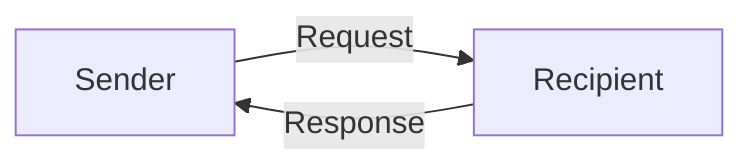
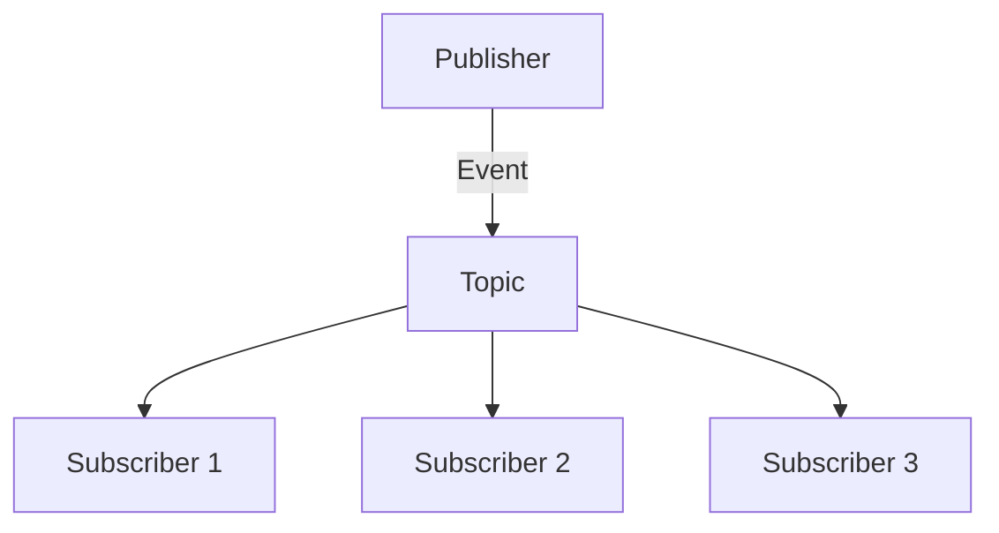
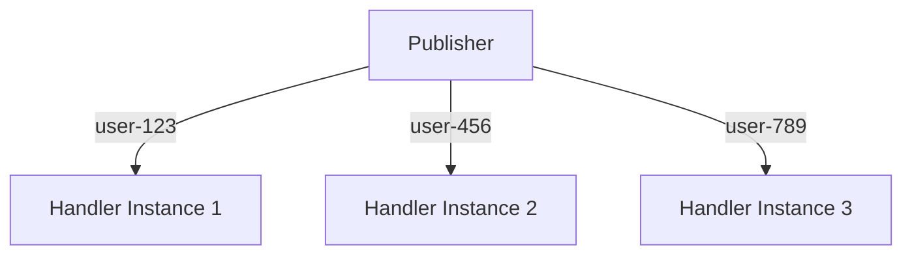

Message passing is the foundation of communication in AutoGen Core. Agents communicate exclusively through asynchronous messages, following the Actor model with no shared state.

## Message Types

Any Python object can be a message. Common patterns:

### Dataclass Messages

```python
from dataclasses import dataclass

@dataclass
class TaskRequest:
    task_id: str
    priority: int
    data: dict

@dataclass
class TaskResponse:
    task_id: str
    result: str
    success: bool

@dataclass
class StatusEvent:
    status: str
    timestamp: float
```

<Tip>
  Use dataclasses for messages. They're simple, type-safe, and work well with serialization.
</Tip>

### Pydantic Models

```python
from pydantic import BaseModel, Field

class ValidationRequest(BaseModel):
    data: dict
    rules: list[str] = Field(default_factory=list)

class ValidationResponse(BaseModel):
    valid: bool
    errors: list[str] = Field(default_factory=list)
```

## MessageContext

Every message handler receives a `MessageContext` with metadata about the message:

```python
from dataclasses import dataclass
from autogen_core import MessageContext, AgentId, TopicId, CancellationToken

@dataclass
class MessageContext:
    sender: AgentId | None
    """The agent that sent the message, or None if sent externally."""
    
    topic_id: TopicId | None
    """The topic this message was published to, or None for direct messages."""
    
    is_rpc: bool
    """True if this is an RPC (expects response), False for events."""
    
    cancellation_token: CancellationToken
    """Token to check if operation was cancelled."""
    
    message_id: str
    """Unique identifier for this message."""
```

### Using MessageContext

```python
from autogen_core import RoutedAgent, MessageContext, event, rpc

class MyAgent(RoutedAgent):
    @rpc
    async def handle_request(self, message: Request, ctx: MessageContext) -> Response:
        # Check who sent the message
        if ctx.sender:
            print(f"Request from: {ctx.sender.type}/{ctx.sender.key}")
        
        # Check if operation was cancelled
        if ctx.cancellation_token.is_cancelled():
            raise asyncio.CancelledError()
        
        # Reply with response
        return Response(data="processed")
    
    @event
    async def handle_event(self, message: StatusEvent, ctx: MessageContext) -> None:
        # Check if published to topic
        if ctx.topic_id:
            print(f"Event on topic: {ctx.topic_id.type}/{ctx.topic_id.source}")
        
        # Events don't return responses
        assert not ctx.is_rpc
```

## MessageHandlerContext

`MessageHandlerContext` provides access to the current agent's ID from within a message handler:

```python
from autogen_core import MessageHandlerContext, AgentId

class MyAgent(RoutedAgent):
    @rpc
    async def handle_request(self, message: Request, ctx: MessageContext) -> Response:
        # Get current agent's ID
        my_id: AgentId = MessageHandlerContext.agent_id()
        print(f"I am: {my_id.type}/{my_id.key}")
        
        return Response()
```

<Warning>
  `MessageHandlerContext.agent_id()` must be called from within a message handler. It raises `RuntimeError` if called outside a handler context.
</Warning>

## Topics and Publishing

### TopicId

`TopicId` identifies a publish-subscribe topic:

```python
from autogen_core import TopicId

# Create topic ID
topic = TopicId(
    type="task.status",  # Event type (CloudEvents spec)
    source="worker-1"    # Event source context
)

print(str(topic))  # "task.status/worker-1"

# Parse from string
topic = TopicId.from_str("task.status/worker-1")
```

**TopicId components:**

<ParamField path="type" type="string" required>
  Event type following CloudEvents spec. Must match pattern: `^[\w\-\.\:\=]+$`
  
  Examples: `task.completed`, `user.login`, `system.error`
</ParamField>

<ParamField path="source" type="string" required>
  Context where the event happened. Can be any string.
  
  Examples: `worker-1`, `api-gateway`, `user-123`
</ParamField>

### DefaultTopicId

`DefaultTopicId` is a predefined topic for simple pub-sub:

```python
from autogen_core import DefaultTopicId

# Use default topic
await runtime.publish_message(
    message=StatusEvent(status="ready"),
    topic_id=DefaultTopicId()
)
```

### Publishing Messages

From an agent:

```python
class Publisher(RoutedAgent):
    @rpc
    async def do_work(self, message: WorkRequest, ctx: MessageContext) -> WorkResponse:
        # Publish progress event
        await self.publish_message(
            StatusEvent(status="working"),
            TopicId(type="status", source=self.id.key)
        )
        
        # Do work...
        
        return WorkResponse(result="done")
```

From the runtime:

```python
# External publish (no sender)
await runtime.publish_message(
    message=SystemEvent(event="startup"),
    topic_id=TopicId(type="system", source="runtime")
)
```

## Subscriptions

Subscriptions define which agents receive messages published to topics.

### Subscription Protocol

```python
from autogen_core import Subscription, TopicId, AgentId
from typing import Protocol

class Subscription(Protocol):
    @property
    def id(self) -> str:
        """Unique subscription ID (usually UUID)."""
        ...
    
    def is_match(self, topic_id: TopicId) -> bool:
        """Check if this subscription matches the topic."""
        ...
    
    def map_to_agent(self, topic_id: TopicId) -> AgentId:
        """Map topic to agent ID that should handle it."""
        ...
```

### TypeSubscription

`TypeSubscription` matches topics by type and creates agent instances per source:

```python
from autogen_core import TypeSubscription, TopicId, AgentId

# Subscribe to topic type
subscription = TypeSubscription(
    topic_type="task.status",
    agent_type="monitor"
)

# How it works:
# TopicId(type="task.status", source="worker-1") -> AgentId(type="monitor", key="worker-1")
# TopicId(type="task.status", source="worker-2") -> AgentId(type="monitor", key="worker-2")

await runtime.add_subscription(subscription)
```

<Info>
  `TypeSubscription` creates separate agent instances for each source. Use when you want per-source state isolation.
</Info>

**Example:**

```python
class Monitor(RoutedAgent):
    def __init__(self):
        super().__init__("Monitor")
        self.events = []  # Each source gets its own monitor instance
    
    @event
    async def handle_status(self, message: StatusEvent, ctx: MessageContext) -> None:
        self.events.append(message)
        print(f"Monitor {self.id.key} got event: {message.status}")

# Register
await Monitor.register(runtime, "monitor", lambda: Monitor())

# Subscribe to status updates
await runtime.add_subscription(
    TypeSubscription(topic_type="status", agent_type="monitor")
)

# Publish from different sources
await runtime.publish_message(
    StatusEvent(status="ready"),
    TopicId(type="status", source="worker-1")
)  # Creates Monitor(key="worker-1")

await runtime.publish_message(
    StatusEvent(status="busy"),
    TopicId(type="status", source="worker-2")
)  # Creates Monitor(key="worker-2")
```

### DefaultSubscription

`DefaultSubscription` subscribes an agent to the default topic:

```python
from autogen_core import DefaultSubscription, default_subscription

# Manual subscription
await runtime.add_subscription(
    DefaultSubscription(agent_type="logger")
)

# Or use decorator
@default_subscription
class Logger(RoutedAgent):
    @event
    async def log_event(self, message: Any, ctx: MessageContext) -> None:
        print(f"Logged: {message}")
```

### TypePrefixSubscription

`TypePrefixSubscription` matches topics by type prefix (internal use):

```python
from autogen_core import TypePrefixSubscription

# Subscribe to all topics starting with "task."
subscription = TypePrefixSubscription(
    topic_type_prefix="task.",  # Must end with separator
    agent_type="task_handler"
)
```

<Note>
  `TypePrefixSubscription` is mainly used internally for direct message routing. For application-level subscriptions, use `TypeSubscription` or `DefaultSubscription`.
</Note>

### Subscription Decorators

```python
from autogen_core import default_subscription, type_subscription, RoutedAgent

# Subscribe to default topic
@default_subscription
class DefaultHandler(RoutedAgent):
    pass

# Subscribe to specific type
@type_subscription(topic_type="events", agent_type="event_handler")
class EventHandler(RoutedAgent):
    pass

# Register agent (subscriptions are added automatically)
await EventHandler.register(runtime, "event_handler", lambda: EventHandler("Handler"))
```

## Message Routing Patterns

### Pattern 1: Direct RPC

```python
# One-to-one request-response
response = await runtime.send_message(
    message=Request(data="process this"),
    recipient=AgentId("processor", "instance-1")
)
```



### Pattern 2: Broadcast Events

```python
# One-to-many fire-and-forget
await runtime.publish_message(
    message=Event(data="something happened"),
    topic_id=TopicId(type="events", source="system")
)
```



### Pattern 3: Per-Source Routing

```python
# TypeSubscription creates separate agent per source
await runtime.add_subscription(
    TypeSubscription(topic_type="user.action", agent_type="user_handler")
)

# Each user gets their own handler instance
await runtime.publish_message(
    UserAction(action="login"),
    TopicId(type="user.action", source="user-123")
)  # Routes to AgentId("user_handler", "user-123")

await runtime.publish_message(
    UserAction(action="logout"),
    TopicId(type="user.action", source="user-456")
)  # Routes to AgentId("user_handler", "user-456")
```



## Cancellation

```python
from autogen_core import CancellationToken
import asyncio

# Create cancellation token
token = CancellationToken()

# Send with token
task = asyncio.create_task(
    runtime.send_message(
        message=LongRunningRequest(),
        recipient=AgentId("worker", "default"),
        cancellation_token=token
    )
)

# Cancel after timeout
await asyncio.sleep(5)
token.cancel()

try:
    await task
except asyncio.CancelledError:
    print("Operation cancelled")
```

### Checking Cancellation in Handler

```python
class Worker(RoutedAgent):
    @rpc
    async def long_task(self, message: Request, ctx: MessageContext) -> Response:
        for i in range(100):
            # Check if cancelled
            if ctx.cancellation_token.is_cancelled():
                raise asyncio.CancelledError()
            
            # Do work
            await asyncio.sleep(0.1)
        
        return Response(result="completed")
```

## Message Serialization

Messages must be serializable for distributed runtime:

### Custom Serializer

```python
from autogen_core import MessageSerializer
import json
from typing import Any

class MyMessageSerializer(MessageSerializer[MyMessage]):
    @property
    def data_content_type(self) -> str:
        return "application/json"
    
    def serialize(self, message: MyMessage) -> bytes:
        return json.dumps({
            'field1': message.field1,
            'field2': message.field2
        }).encode('utf-8')
    
    def deserialize(self, data: bytes) -> MyMessage:
        obj = json.loads(data.decode('utf-8'))
        return MyMessage(field1=obj['field1'], field2=obj['field2'])

# Register serializer
runtime.add_message_serializer(MyMessageSerializer())
```

### Known Serializers

```python
from autogen_core import try_get_known_serializers_for_type

# Get serializers for type
serializers = try_get_known_serializers_for_type(MyMessage)
if serializers:
    print(f"Found {len(serializers)} serializers")
else:
    print("No serializers found")
```

## Complete Example

```python
import asyncio
from dataclasses import dataclass
from autogen_core import (
    SingleThreadedAgentRuntime,
    RoutedAgent,
    MessageContext,
    AgentId,
    TopicId,
    TypeSubscription,
    event,
    rpc
)

@dataclass
class TaskRequest:
    task_id: str
    data: str

@dataclass
class TaskResponse:
    task_id: str
    result: str

@dataclass
class TaskEvent:
    task_id: str
    event: str

class Worker(RoutedAgent):
    def __init__(self):
        super().__init__("Worker")
    
    @rpc
    async def process(self, message: TaskRequest, ctx: MessageContext) -> TaskResponse:
        # Announce start
        await self.publish_message(
            TaskEvent(task_id=message.task_id, event="started"),
            TopicId(type="task.events", source=message.task_id)
        )
        
        # Process
        result = f"Processed: {message.data}"
        
        # Announce completion
        await self.publish_message(
            TaskEvent(task_id=message.task_id, event="completed"),
            TopicId(type="task.events", source=message.task_id)
        )
        
        return TaskResponse(task_id=message.task_id, result=result)

class Monitor(RoutedAgent):
    def __init__(self):
        super().__init__("Monitor")
        self.events = []
    
    @event
    async def track(self, message: TaskEvent, ctx: MessageContext) -> None:
        self.events.append((message.task_id, message.event))
        print(f"Task {message.task_id}: {message.event}")

async def main():
    runtime = SingleThreadedAgentRuntime()
    
    # Register agents
    await Worker.register(runtime, "worker", lambda: Worker())
    await Monitor.register(runtime, "monitor", lambda: Monitor())
    
    # Subscribe monitor to task events
    await runtime.add_subscription(
        TypeSubscription(topic_type="task.events", agent_type="monitor")
    )
    
    runtime.start()
    
    # Send task
    response = await runtime.send_message(
        TaskRequest(task_id="123", data="sample"),
        recipient=AgentId("worker", "default")
    )
    print(f"Response: {response.result}")
    
    await asyncio.sleep(0.1)  # Let events process
    await runtime.stop_when_idle()

if __name__ == "__main__":
    asyncio.run(main())
```

## Next Steps

<CardGroup cols={2}>
  <Card title="Event-Driven Architecture" icon="bolt" href="/core/event-driven-architecture">
    Learn about event handlers and message routing
  </Card>
  <Card title="Distributed Runtime" icon="globe" href="/core/distributed-runtime">
    Scale message passing across processes
  </Card>
  <Card title="Agent Runtime" icon="server" href="/core/agent-runtime">
    Understand runtime operations
  </Card>
  <Card title="Core Overview" icon="book" href="/core/overview">
    Return to Core API overview
  </Card>
</CardGroup>
